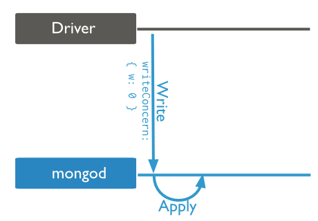
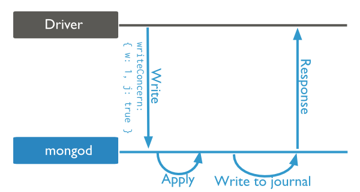
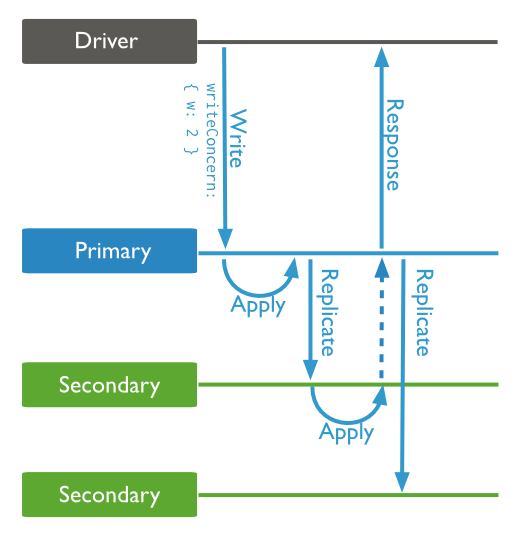

.. image:: https://img.shields.io/badge/Tag-MongoDB-brightgreen.svg
   :target: https://www.mongodb.com/

.. image:: https://img.shields.io/badge/Tag-Write_Concern-brightgreen.svg
   :target: https://docs.mongodb.com/manual/reference/write-concern/

Write Concern详解
=================
在执行写操作时, MongoDB会对写操作是否正确地完成了做一个确认。而这个确认的方式有着不同的等级。这个就叫做Write Convern。

Write Convern等级
----------------

Unacknowledge
~~~~~~~~~~~~~
不对写操作做确认。换言之, 如果你的客户端程序中连续有两条写操作, 那么执行完第一条, 将数据发送给数据库之后, 不会等任何确认, 就会直接执行第二条。 Unackoledge和ignore非常相似, 但是客户端依旧能捕获网络错误, 也就是说如果网络发生了错误, 客户端是不会直接执行第二条写入命令的。

Acknowledged
~~~~~~~~~~~~
当数据被成功的写入到内存数据中时, 通知客户端成功了。 这种模式下能够捕捉到网络错误, duplicate key错误和其他错误。 但是这并不能保证数据已经被写入到内存了。 也就是说 **如果此时数据库突然掉电, 如果没有复制集, 则会丢失掉刚才写入的数据**。

.. image:: crud-write-concern-ack.png
   :target: https://docs.mongodb.com/v2.6/core/write-concern/#acknowledged

Journaled
~~~~~~~~~
在此模式下, 比Achnowledged模式更多一层保护的是, 只有当写操作命令被写入日志后, 才会通知客户端成功了。 这种模式 **保证了我们可以随时从日志中恢复数据**。

Replica Acknowledged
~~~~~~~~~~~~~~~~~~~~
如果你的数据库有replica set, 而MongoDB的写操作只发生在primary上, 在此模式下, 不仅primary要确认写入日志, 连所有的secondary都需要确认才行。 请注意, **如果primary挂掉, 所有的secondary会发起一次选举, 比较大家的数据, 然后用与大部分secondary的数据版本一致的那个secondary当primary**。 所以在新的3.0以及更高的版本中, 多了一个选项 ``w: "majority"``, 使得只需要大多数的secondary都确认了, 就可以通知客户端成功了。 这样可以不需要等待所有的replica set都确认, 但是又能保证挂掉之后恢复的数据仍然是最新的。

在2.6中, 默认是Unacknowledge。 而在3.0, 3.2中, 默认是Acknowledged。

关于MongoDB在写操作的整个流程中具体发生了什么, 请参考 :ref:`这篇文档 <write_to_disk>`。

参考资料
-------
- `mongodb的write concern <http://kyfxbl.iteye.com/blog/1952941>`_
- `2.6版本的Write Concern(写的较为清楚) <https://docs.mongodb.com/v2.6/core/write-concern/>`_
- `3.2版本的Write Concern <https://docs.mongodb.com/manual/reference/write-concern/>`_
